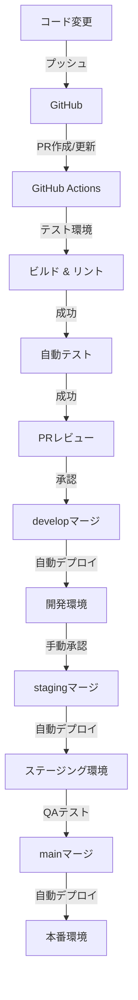

# MapStack 開発ガイド

---
title: 開発ガイド
importance: high
last_updated: 2025-04-04
for_ai_assistant: このドキュメントはMapStackの開発プロセスと規約を定義しています。コード生成時はこれらの規約に従ってください。特にコーディング規約と命名規則を遵守することが重要です。
---

## コーディング規約

### 全般的なガイドライン

- **DRY (Don't Repeat Yourself)** 原則を遵守する
- **KISS (Keep It Simple, Stupid)** - 複雑さより明快さを優先する
- **YAGNI (You Aren't Gonna Need It)** - 必要になるまで機能を追加しない
- コードの可読性と保守性を最優先する
- 適切なコメントを追加するが、自己説明的なコードを目指す
- Git コミットメッセージは明確で一貫性のある形式にする

### 命名規則

| 要素 | 規則 | 例 |
|------|------|------|
| **変数** | キャメルケース | `userName`, `isActive` |
| **関数/メソッド** | キャメルケース | `getUserData()`, `calculateTotal()` |
| **クラス/インターフェース/型** | パスカルケース | `UserProfile`, `AuthService` |
| **定数** | 大文字スネークケース | `MAX_RETRY_COUNT`, `API_BASE_URL` |
| **ファイル名 (フロントエンド)** | パスカルケース（コンポーネント）<br>キャメルケース（ユーティリティ） | `UserCard.tsx`, `authUtils.ts` |
| **ファイル名 (バックエンド)** | スネークケース | `user_service.py`, `auth_utils.py` |
| **データベーステーブル** | スネークケース、複数形 | `users`, `learning_activities` |
| **API エンドポイント** | ケバブケース | `/api/user-progress`, `/auth/reset-password` |

### フロントエンド (React / Next.js)

- **コンポーネント設計**
  - 単一責任の原則に従う
  - Presentational と Container コンポーネントを分離
  - コンポーネントは小さく保ち、300行を超えないようにする
  - Props には型定義を必ず付ける

- **TypeScript**
  - `any` 型の使用を避ける、代わりに適切な型または `unknown` を使用
  - Interface で Props 型を定義し、エクスポートする
  - ジェネリクスは適切な場合のみ使用する
  - オプショナルプロパティにはデフォルト値を設定する

- **スタイリング (Tailwind CSS)**
  - クラス名の順序は以下の優先度で記述:
    1. レイアウト・表示 (`flex`, `grid`, `block`)
    2. 位置・サイズ (`w-`, `h-`, `m-`, `p-`)
    3. 背景・境界線 (`bg-`, `border-`)
    4. タイポグラフィ (`text-`, `font-`)
    5. その他 (`opacity-`, `shadow-`)
  - 複雑なスタイルは `@apply` でコンポーネント化
  - ダークモード対応は `dark:` プレフィックスで一貫して実装

- **状態管理 (Zustand)**
  - ストアは機能ごとに分割
  - 非同期アクションはストア内で定義
  - セレクタを使用して最適化
  - TypeScript で型安全性を確保

```typescript
// ストア定義の例
import { create } from 'zustand';

interface UserState {
  user: User | null;
  isLoading: boolean;
  error: string | null;
  fetchUser: (id: string) => Promise<void>;
  logout: () => void;
}

const useUserStore = create<UserState>((set) => ({
  user: null,
  isLoading: false,
  error: null,
  fetchUser: async (id) => {
    set({ isLoading: true, error: null });
    try {
      const response = await fetch(`/api/users/${id}`);
      const user = await response.json();
      set({ user, isLoading: false });
    } catch (error) {
      set({ error: (error as Error).message, isLoading: false });
    }
  },
  logout: () => set({ user: null })
}));
```

### バックエンド (FastAPI / Python)

- **PEP 8** ガイドラインに従う
- **型ヒント**を積極的に活用する
- **依存性注入**パターンを使用する
- ルーティング関数は軽量に保ち、ビジネスロジックはサービス層に移動
- エラー処理は明示的に行い、適切なHTTPステータスコードを返す
- 環境変数は `pydantic.BaseSettings` で管理

```python
# APIエンドポイント定義の例
from fastapi import APIRouter, Depends, HTTPException, status
from sqlalchemy.orm import Session

from app.core.deps import get_db, get_current_user
from app.services import user_service
from app.schemas.user import UserResponse, UserUpdate

router = APIRouter(prefix="/users", tags=["users"])

@router.get("/{user_id}", response_model=UserResponse)
async def get_user(
    user_id: str,
    db: Session = Depends(get_db),
    current_user: User = Depends(get_current_user)
):
    """ユーザー情報を取得する"""
    if user_id != current_user.id and not current_user.is_admin:
        raise HTTPException(
            status_code=status.HTTP_403_FORBIDDEN,
            detail="権限がありません"
        )
    
    user = user_service.get_user_by_id(db, user_id)
    if not user:
        raise HTTPException(
            status_code=status.HTTP_404_NOT_FOUND,
            detail="ユーザーが見つかりません"
        )
    
    return user
```

### データベース

- テーブル名は複数形、小文字、スネークケース
- 主キーは `id` (UUID)
- 外部キーは `{entity_name}_id` の形式
- タイムスタンプフィールド `created_at`, `updated_at` を全テーブルに含める
- インデックスは慎重に計画し、命名規則を統一する
- トランザクションは適切な粒度で使用

```sql
-- テーブル定義の例
CREATE TABLE user_progress (
    id UUID PRIMARY KEY DEFAULT gen_random_uuid(),
    user_id UUID NOT NULL REFERENCES users(id) ON DELETE CASCADE,
    node_id UUID NOT NULL REFERENCES nodes(id) ON DELETE CASCADE,
    status VARCHAR(20) NOT NULL,
    started_at TIMESTAMP WITH TIME ZONE,
    completed_at TIMESTAMP WITH TIME ZONE,
    last_activity TIMESTAMP WITH TIME ZONE,
    notes TEXT,
    created_at TIMESTAMP WITH TIME ZONE DEFAULT CURRENT_TIMESTAMP,
    updated_at TIMESTAMP WITH TIME ZONE DEFAULT CURRENT_TIMESTAMP,
    UNIQUE(user_id, node_id)
);

CREATE INDEX idx_user_progress_user_id ON user_progress(user_id);
CREATE INDEX idx_user_progress_node_id ON user_progress(node_id);
CREATE INDEX idx_user_progress_status ON user_progress(status);
```

## レビュープロセス

### プルリクエスト作成ガイドライン

1. **準備**
   - 作業前に最新の `develop` ブランチから派生させる
   - 機能単位で小さなPRを心がける（理想は300-500行以内）
   - 適切な命名規則でブランチを作成
     - 機能追加: `feature/add-user-dashboard`
     - バグ修正: `bugfix/fix-auth-redirect`
     - リファクタリング: `refactor/optimize-roadmap-rendering`

2. **説明**
   - PRテンプレートに従って詳細な説明を記載
   - 関連するIssue番号をリンク
   - スクリーンショットや動画（UI変更の場合）
   - テスト手順の明示

3. **セルフレビュー**
   - PR提出前にセルフレビューを実施
   - 不要なコメントやconsole.logの削除
   - リンター/フォーマッターの実行
   - テストが実行され合格していることを確認

### レビュープロセス

1. **レビュー担当割り当て**
   - 少なくとも1名の主担当レビュアーを指定
   - 複雑な変更の場合は複数のレビュアーを指定

2. **レビュー基準**
   - 機能要件の充足
   - コード品質とベストプラクティス
   - パフォーマンスとセキュリティの考慮
   - テストカバレッジの十分さ
   - ドキュメントの更新

3. **レビューコメント対応**
   - 24時間以内にレビューコメントに返答
   - 変更が必要な場合は同じPRに追加コミット
   - 議論が必要な場合はPRコメントで議論

4. **マージ条件**
   - 少なくとも1名のレビュアーの承認
   - すべてのCIチェックの合格
   - 未解決のコメントがないこと
   - コンフリクトがないこと

### レビュー時のチェックリスト

**一般**
- [ ] コーディング規約に従っているか
- [ ] エラー処理が適切か
- [ ] パフォーマンスの問題がないか
- [ ] セキュリティの脆弱性がないか
- [ ] 国際化対応の考慮があるか

**フロントエンド**
- [ ] コンポーネントの責任範囲が明確か
- [ ] アクセシビリティに配慮しているか
- [ ] レスポンシブデザインが適切か
- [ ] 状態管理が効率的か
- [ ] 不要な再レンダリングがないか

**バックエンド**
- [ ] APIの入出力バリデーションが適切か
- [ ] データベースクエリが最適化されているか
- [ ] トランザクション管理が適切か
- [ ] 認証・認可のチェックが確実か
- [ ] レート制限やキャッシュの考慮があるか

## テスト戦略

### テスト階層

```
                      ┌─────────────────┐
                      │    E2Eテスト     │   10% (重要フロー)
                      └─────────────────┘
                     ┌─────────────────────┐
                     │   統合テスト        │   30% (コンポーネント間連携)
                     └─────────────────────┘
            ┌────────────────────────────────────────┐
            │          ユニットテスト                │   60% (個別機能)
            └────────────────────────────────────────┘
```

### テスト種類と責任範囲

| テスト種類 | ツール | 責任範囲 | 実行タイミング |
|----------|-------|----------|--------------|
| ユニットテスト | Jest (FE)<br>Pytest (BE) | 個別関数/コンポーネントの動作<br>ビジネスロジック | PR毎、コミット時 |
| 統合テスト | React Testing Library (FE)<br>Pytest + TestClient (BE) | コンポーネント連携<br>API統合<br>DB操作 | PR毎 |
| E2Eテスト | Playwright | 重要ユーザーフロー<br>クリティカルパス | 日次、リリース前 |
| パフォーマンステスト | Lighthouse<br>JMeter | ページロード<br>API応答時間 | 週次、リリース前 |
| セキュリティテスト | OWASP ZAP<br>npm audit | 脆弱性スキャン<br>依存パッケージチェック | 週次、リリース前 |

### テスト作成ガイドライン

**フロントエンドテスト（Jest / React Testing Library）**

```typescript
// UserProfileコンポーネントのテスト例
import { render, screen, waitFor } from '@testing-library/react';
import userEvent from '@testing-library/user-event';
import UserProfile from './UserProfile';
import { useUserStore } from '../../../stores/userStore';

// モックの作成
jest.mock('../../../stores/userStore');

describe('UserProfile', () => {
  const mockUser = {
    id: '123',
    name: 'テストユーザー',
    email: 'test@example.com',
    bio: 'テスト用プロフィール'
  };
  
  beforeEach(() => {
    // ストアのモック設定
    (useUserStore as jest.Mock).mockReturnValue({
      user: mockUser,
      updateProfile: jest.fn()
    });
  });
  
  it('ユーザー情報が正しく表示される', () => {
    render(<UserProfile />);
    
    expect(screen.getByText('テストユーザー')).toBeInTheDocument();
    expect(screen.getByText('test@example.com')).toBeInTheDocument();
    expect(screen.getByText('テスト用プロフィール')).toBeInTheDocument();
  });
  
  it('プロフィール更新が呼び出される', async () => {
    const mockUpdateProfile = jest.fn();
    (useUserStore as jest.Mock).mockReturnValue({
      user: mockUser,
      updateProfile: mockUpdateProfile
    });
    
    render(<UserProfile />);
    
    const bioInput = screen.getByLabelText(/自己紹介/i);
    userEvent.clear(bioInput);
    userEvent.type(bioInput, '新しい自己紹介');
    
    const saveButton = screen.getByRole('button', { name: /保存/i });
    userEvent.click(saveButton);
    
    await waitFor(() => {
      expect(mockUpdateProfile).toHaveBeenCalledWith(
        expect.objectContaining({ bio: '新しい自己紹介' })
      );
    });
  });
});
```

**バックエンドテスト（Pytest）**

```python
# user_service のテスト例
import pytest
from sqlalchemy.orm import Session
from uuid import uuid4

from app.services.user_service import get_user_by_id, update_user
from app.models.user import User
from app.schemas.user import UserUpdate

def test_get_user_by_id(db_session: Session):
    # テストデータ準備
    user_id = str(uuid4())
    db_user = User(
        id=user_id,
        email="test@example.com",
        hashed_password="hashed_password",
        first_name="Test",
        last_name="User"
    )
    db_session.add(db_user)
    db_session.commit()
    
    # テスト実行
    result = get_user_by_id(db_session, user_id)
    
    # 検証
    assert result is not None
    assert result.id == user_id
    assert result.email == "test@example.com"
    assert result.first_name == "Test"
    assert result.last_name == "User"

def test_update_user(db_session: Session):
    # テストデータ準備
    user_id = str(uuid4())
    db_user = User(
        id=user_id,
        email="test@example.com",
        hashed_password="hashed_password",
        first_name="Test",
        last_name="User"
    )
    db_session.add(db_user)
    db_session.commit()
    
    # 更新データ準備
    update_data = UserUpdate(
        first_name="Updated",
        bio="New bio information"
    )
    
    # テスト実行
    updated_user = update_user(db_session, user_id, update_data)
    
    # 検証
    assert updated_user.first_name == "Updated"
    assert updated_user.last_name == "User"  # 変更なし
    assert updated_user.bio == "New bio information"
    
    # DBに反映されていることを確認
    db_session.refresh(db_user)
    assert db_user.first_name == "Updated"
    assert db_user.bio == "New bio information"
```

### テストカバレッジ要件

- **フロントエンド**:
  - ユーティリティ関数: 90%以上
  - 共通コンポーネント: 80%以上
  - ページコンポーネント: 70%以上
  - ストア: 85%以上

- **バックエンド**:
  - サービス層: 90%以上
  - モデル: 85%以上
  - APIエンドポイント: 80%以上
  - ユーティリティ: 90%以上

## CI/CD運用指針

### CI/CD パイプライン概要



### 環境構成

| 環境 | 目的 | デプロイトリガー | URL パターン |
|-----|------|----------------|------------|
| 開発 (Dev) | 継続的な開発 | `develop` ブランチへのマージ | `dev.mapstack.app` |
| ステージング (Staging) | QA、受け入れテスト | `staging` ブランチへのマージ | `staging.mapstack.app` |
| 本番 (Production) | エンドユーザー向け | `main` ブランチへのマージ | `mapstack.app` |
| プレビュー (PR) | PR 検証 | PR 作成/更新時 | `pr-{number}.mapstack.vercel.app` |

### CI プロセス (GitHub Actions)

```yaml
# .github/workflows/ci.yml の例
name: CI Pipeline

on:
  push:
    branches: [ develop, staging, main ]
  pull_request:
    branches: [ develop ]

jobs:
  lint:
    runs-on: ubuntu-latest
    steps:
      - uses: actions/checkout@v3
      - name: Setup Node.js
        uses: actions/setup-node@v3
        with:
          node-version: '18'
      - name: Install dependencies
        run: npm ci
      - name: Lint
        run: npm run lint
  
  test:
    needs: lint
    runs-on: ubuntu-latest
    steps:
      - uses: actions/checkout@v3
      - name: Setup Node.js
        uses: actions/setup-node@v3
        with:
          node-version: '18'
      - name: Install dependencies
        run: npm ci
      - name: Test
        run: npm test
      - name: Upload coverage
        uses: codecov/codecov-action@v3
  
  build:
    needs: test
    runs-on: ubuntu-latest
    steps:
      - uses: actions/checkout@v3
      - name: Setup Node.js
        uses: actions/setup-node@v3
        with:
          node-version: '18'
      - name: Install dependencies
        run: npm ci
      - name: Build
        run: npm run build
```

### CD プロセス (Vercel / GitHub Actions)

- **フロントエンド (Vercel)**
  - `develop`/`staging`/`main` ブランチへのプッシュで自動デプロイ
  - PR作成時にプレビュー環境を自動生成
  - デプロイ前に環境変数を自動設定

- **バックエンド (GitHub Actions + AWS)**
  - `develop`/`staging`/`main` ブランチへのプッシュで自動デプロイ
  - ECRへのDockerイメージのプッシュ
  - ECSサービスの更新

### デプロイ管理

1. **デプロイ頻度**
   - 開発環境: 日次複数回（PR マージごと）
   - ステージング環境: 日次～週次（機能完成時）
   - 本番環境: 週次～隔週（QA完了後）

2. **リリース管理**
   - セマンティックバージョニングを使用
   - リリースノートを自動生成
   - デプロイ履歴の追跡

3. **ロールバック手順**
   - Vercel: 管理コンソールから以前のデプロイに戻す
   - バックエンド: 以前のDockerイメージにロールバック
   - データベース: マイグレーションは累積方式、ロールバック可能に設計

### 監視とアラート

- **監視ツール**
  - Sentry: エラートラッキング
  - Datadog: パフォーマンス監視
  - CloudWatch: インフラストラクチャ監視

- **アラート設定**
  - エラー率: 1分間に5%以上でアラート
  - API応答時間: 平均2秒以上でアラート
  - サーバーリソース: CPU 80%以上、メモリ85%以上でアラート

- **オンコール対応**
  - 平日: 担当者ローテーション
  - 休日: 緊急連絡先リスト

## トラブルシューティングガイド

### 開発環境の問題

**症状**: 環境変数が読み込まれない
**解決策**:
1. `.env.local` ファイルが存在するか確認
2. `npm run dev` を再起動
3. 環境変数名が正確か確認（Next.jsは `NEXT_PUBLIC_` プレフィックスに注意）

**症状**: APIリクエストが失敗する
**解決策**:
1. バックエンドサーバーが起動しているか確認
2. CORS設定が正しいか確認
3. リクエストURLとメソッドを確認

### デバッグテクニック

**フロントエンド**:
- Reactデバッグツール拡張機能を使用
- コンポーネント階層とpropsを確認
- Zustandデバッガーで状態変化を追跡

**バックエンド**:
- `uvicorn` を `--reload --log-level debug` で起動
- リクエスト/レスポンスを `/docs` インターフェースでテスト
- SQLAlchemy `echo=True` でSQLクエリをログ出力

---

*この開発ガイドは、プロジェクトの進行に伴い継続的に更新されます。最新の推奨プラクティスを反映するために定期的に見直しを行います。*
