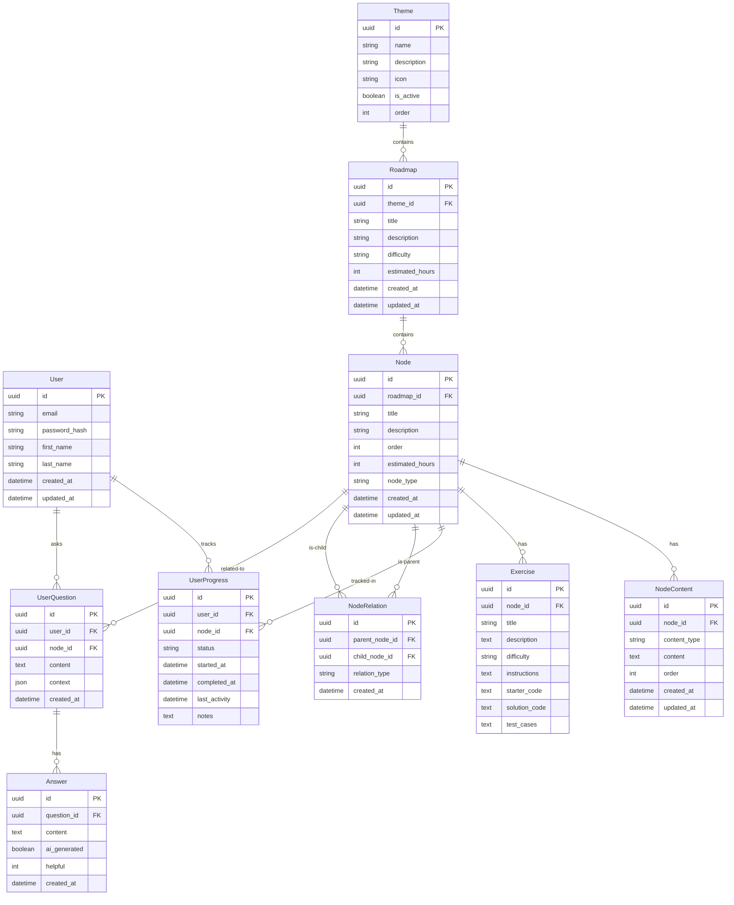
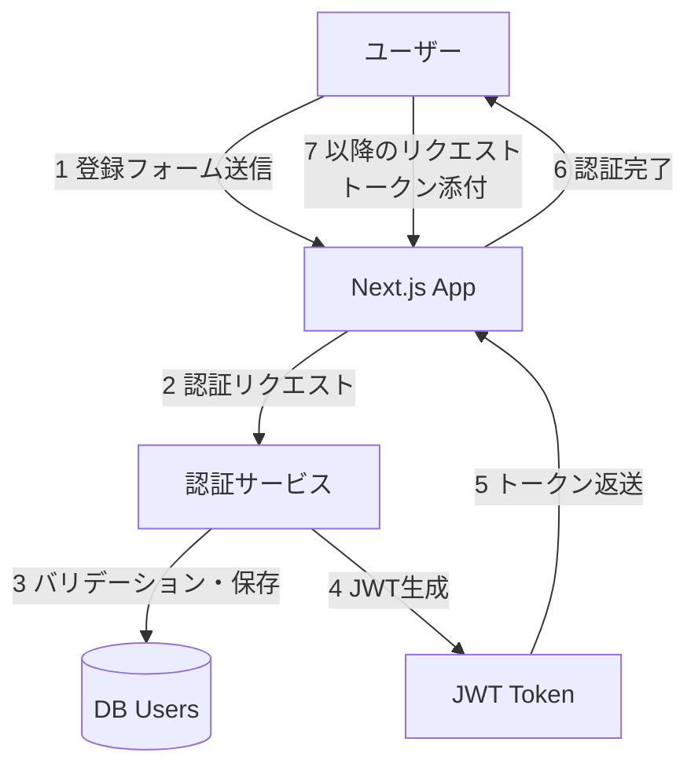
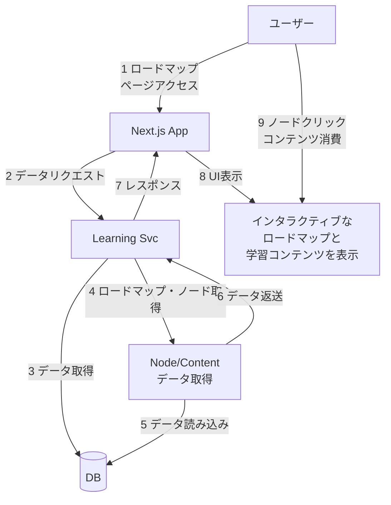
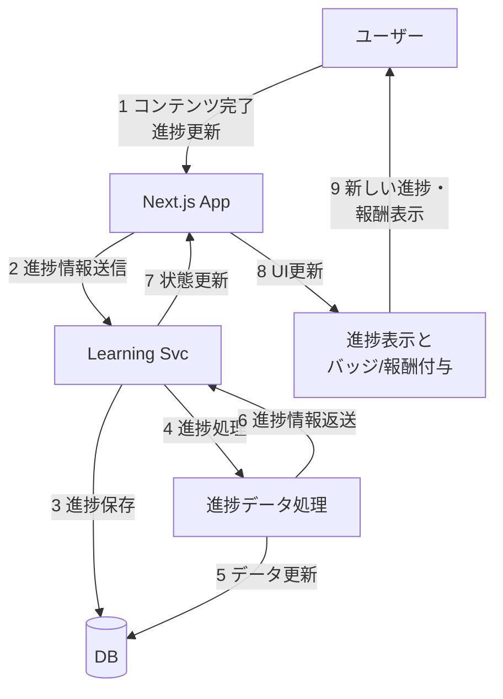
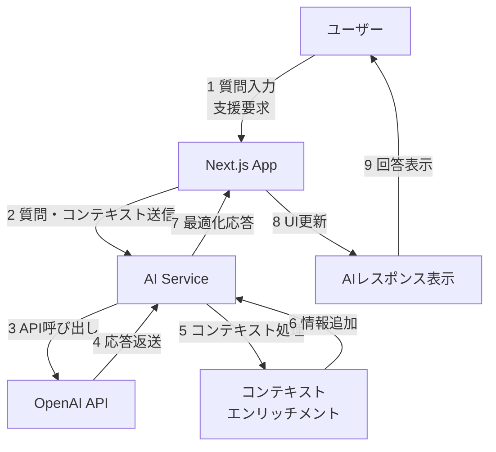
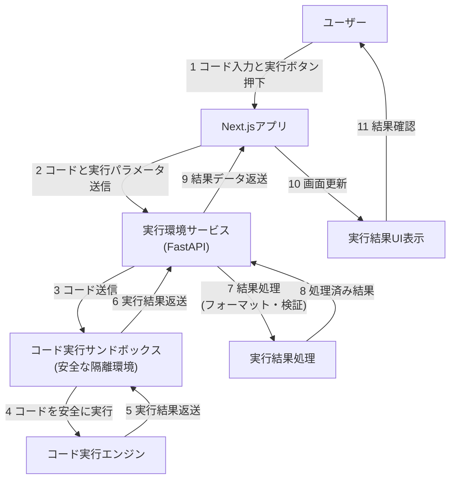
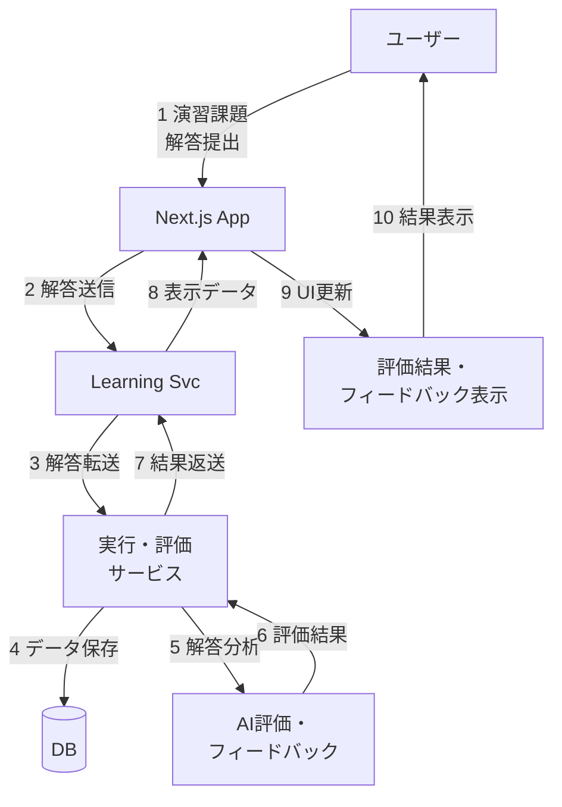

# MapStack データモデル

---
title: データモデル
importance: high
last_updated: 2025-04-04
for_ai_assistant: このドキュメントはMapStackの中核となるデータ構造とAPIを定義しています。実装時はこれらのモデルとリレーションシップに従ってください。マークダウン内のコードブロックには実際の実装例を含みます。
---

## エンティティ関連図



### 主要エンティティ説明

1. **User**: システムのユーザー情報
2. **Theme**: 学習テーマ（フロントエンド開発、バックエンド開発等）
3. **Roadmap**: 特定テーマの学習ロードマップ
4. **Node**: ロードマップ内の学習ノード（トピックや単元）
5. **NodeRelation**: ノード間の関係性（前提条件、関連項目等）
6. **NodeContent**: ノードに関連する学習コンテンツ
7. **Exercise**: 実践演習と課題
8. **UserProgress**: ユーザーの学習進捗状況
9. **UserQuestion**: ユーザーからの質問
10. **Answer**: 質問への回答（AIまたは人間による）

## データベーススキーマ

### ユーザー関連テーブル

#### `users`
```sql
CREATE TABLE users (
    id UUID PRIMARY KEY DEFAULT gen_random_uuid(),
    email VARCHAR(255) NOT NULL UNIQUE,
    password_hash VARCHAR(255) NOT NULL,
    first_name VARCHAR(100),
    last_name VARCHAR(100),
    bio TEXT,
    profile_image_url VARCHAR(255),
    skill_level VARCHAR(50),
    learning_goal TEXT,
    weekly_goal_hours INT,
    last_login TIMESTAMP WITH TIME ZONE,
    is_active BOOLEAN DEFAULT TRUE,
    is_verified BOOLEAN DEFAULT FALSE,
    created_at TIMESTAMP WITH TIME ZONE DEFAULT CURRENT_TIMESTAMP,
    updated_at TIMESTAMP WITH TIME ZONE DEFAULT CURRENT_TIMESTAMP
);

CREATE INDEX idx_users_email ON users(email);
```

#### `user_roles`
```sql
CREATE TABLE user_roles (
    id UUID PRIMARY KEY DEFAULT gen_random_uuid(),
    user_id UUID NOT NULL REFERENCES users(id) ON DELETE CASCADE,
    role_name VARCHAR(50) NOT NULL,
    created_at TIMESTAMP WITH TIME ZONE DEFAULT CURRENT_TIMESTAMP,
    UNIQUE(user_id, role_name)
);

CREATE INDEX idx_user_roles_user_id ON user_roles(user_id);
```

#### `user_tokens`
```sql
CREATE TABLE user_tokens (
    id UUID PRIMARY KEY DEFAULT gen_random_uuid(),
    user_id UUID NOT NULL REFERENCES users(id) ON DELETE CASCADE,
    token_type VARCHAR(50) NOT NULL,
    token_value VARCHAR(255) NOT NULL,
    expires_at TIMESTAMP WITH TIME ZONE NOT NULL,
    created_at TIMESTAMP WITH TIME ZONE DEFAULT CURRENT_TIMESTAMP,
    is_revoked BOOLEAN DEFAULT FALSE
);

CREATE INDEX idx_user_tokens_user_id ON user_tokens(user_id);
CREATE INDEX idx_user_tokens_token_value ON user_tokens(token_value);
```

### コンテンツ関連テーブル

#### `themes`
```sql
CREATE TABLE themes (
    id UUID PRIMARY KEY DEFAULT gen_random_uuid(),
    name VARCHAR(100) NOT NULL,
    description TEXT,
    icon VARCHAR(100),
    color VARCHAR(20),
    is_active BOOLEAN DEFAULT TRUE,
    order_position INT,
    created_at TIMESTAMP WITH TIME ZONE DEFAULT CURRENT_TIMESTAMP,
    updated_at TIMESTAMP WITH TIME ZONE DEFAULT CURRENT_TIMESTAMP
);
```

#### `roadmaps`
```sql
CREATE TABLE roadmaps (
    id UUID PRIMARY KEY DEFAULT gen_random_uuid(),
    theme_id UUID NOT NULL REFERENCES themes(id),
    title VARCHAR(255) NOT NULL,
    description TEXT,
    short_description VARCHAR(255),
    difficulty VARCHAR(20) NOT NULL,
    estimated_hours INT,
    image_url VARCHAR(255),
    is_published BOOLEAN DEFAULT FALSE,
    created_by UUID REFERENCES users(id),
    created_at TIMESTAMP WITH TIME ZONE DEFAULT CURRENT_TIMESTAMP,
    updated_at TIMESTAMP WITH TIME ZONE DEFAULT CURRENT_TIMESTAMP
);

CREATE INDEX idx_roadmaps_theme_id ON roadmaps(theme_id);
CREATE INDEX idx_roadmaps_difficulty ON roadmaps(difficulty);
CREATE INDEX idx_roadmaps_is_published ON roadmaps(is_published);
```

#### `nodes`
```sql
CREATE TABLE nodes (
    id UUID PRIMARY KEY DEFAULT gen_random_uuid(),
    roadmap_id UUID NOT NULL REFERENCES roadmaps(id) ON DELETE CASCADE,
    title VARCHAR(255) NOT NULL,
    description TEXT,
    order_position INT NOT NULL,
    estimated_hours INT,
    node_type VARCHAR(50) NOT NULL,
    is_published BOOLEAN DEFAULT FALSE,
    created_at TIMESTAMP WITH TIME ZONE DEFAULT CURRENT_TIMESTAMP,
    updated_at TIMESTAMP WITH TIME ZONE DEFAULT CURRENT_TIMESTAMP
);

CREATE INDEX idx_nodes_roadmap_id ON nodes(roadmap_id);
CREATE INDEX idx_nodes_node_type ON nodes(node_type);
```

#### `node_relations`
```sql
CREATE TABLE node_relations (
    id UUID PRIMARY KEY DEFAULT gen_random_uuid(),
    parent_node_id UUID NOT NULL REFERENCES nodes(id) ON DELETE CASCADE,
    child_node_id UUID NOT NULL REFERENCES nodes(id) ON DELETE CASCADE,
    relation_type VARCHAR(50) NOT NULL,
    created_at TIMESTAMP WITH TIME ZONE DEFAULT CURRENT_TIMESTAMP,
    UNIQUE(parent_node_id, child_node_id)
);

CREATE INDEX idx_node_relations_parent_node_id ON node_relations(parent_node_id);
CREATE INDEX idx_node_relations_child_node_id ON node_relations(child_node_id);
```

#### `node_contents`
```sql
CREATE TABLE node_contents (
    id UUID PRIMARY KEY DEFAULT gen_random_uuid(),
    node_id UUID NOT NULL REFERENCES nodes(id) ON DELETE CASCADE,
    content_type VARCHAR(50) NOT NULL,
    title VARCHAR(255),
    content TEXT NOT NULL,
    order_position INT NOT NULL,
    is_published BOOLEAN DEFAULT FALSE,
    created_at TIMESTAMP WITH TIME ZONE DEFAULT CURRENT_TIMESTAMP,
    updated_at TIMESTAMP WITH TIME ZONE DEFAULT CURRENT_TIMESTAMP
);

CREATE INDEX idx_node_contents_node_id ON node_contents(node_id);
CREATE INDEX idx_node_contents_content_type ON node_contents(content_type);
```

#### `exercises`
```sql
CREATE TABLE exercises (
    id UUID PRIMARY KEY DEFAULT gen_random_uuid(),
    node_id UUID NOT NULL REFERENCES nodes(id) ON DELETE CASCADE,
    title VARCHAR(255) NOT NULL,
    description TEXT NOT NULL,
    difficulty VARCHAR(20) NOT NULL,
    instructions TEXT NOT NULL,
    starter_code TEXT,
    solution_code TEXT,
    is_published BOOLEAN DEFAULT FALSE,
    created_at TIMESTAMP WITH TIME ZONE DEFAULT CURRENT_TIMESTAMP,
    updated_at TIMESTAMP WITH TIME ZONE DEFAULT CURRENT_TIMESTAMP
);

CREATE INDEX idx_exercises_node_id ON exercises(node_id);
```

#### `exercise_test_cases`
```sql
CREATE TABLE exercise_test_cases (
    id UUID PRIMARY KEY DEFAULT gen_random_uuid(),
    exercise_id UUID NOT NULL REFERENCES exercises(id) ON DELETE CASCADE,
    description VARCHAR(255),
    test_code TEXT NOT NULL,
    is_hidden BOOLEAN DEFAULT FALSE,
    order_position INT NOT NULL,
    created_at TIMESTAMP WITH TIME ZONE DEFAULT CURRENT_TIMESTAMP
);

CREATE INDEX idx_exercise_test_cases_exercise_id ON exercise_test_cases(exercise_id);
```

### 学習進捗関連テーブル

#### `user_progress`
```sql
CREATE TABLE user_progress (
    id UUID PRIMARY KEY DEFAULT gen_random_uuid(),
    user_id UUID NOT NULL REFERENCES users(id) ON DELETE CASCADE,
    node_id UUID NOT NULL REFERENCES nodes(id) ON DELETE CASCADE,
    status VARCHAR(20) NOT NULL,
    started_at TIMESTAMP WITH TIME ZONE,
    completed_at TIMESTAMP WITH TIME ZONE,
    last_activity TIMESTAMP WITH TIME ZONE,
    completion_percentage INT DEFAULT 0,
    notes TEXT,
    created_at TIMESTAMP WITH TIME ZONE DEFAULT CURRENT_TIMESTAMP,
    updated_at TIMESTAMP WITH TIME ZONE DEFAULT CURRENT_TIMESTAMP,
    UNIQUE(user_id, node_id)
);

CREATE INDEX idx_user_progress_user_id ON user_progress(user_id);
CREATE INDEX idx_user_progress_node_id ON user_progress(node_id);
CREATE INDEX idx_user_progress_status ON user_progress(status);
```

#### `user_exercise_submissions`
```sql
CREATE TABLE user_exercise_submissions (
    id UUID PRIMARY KEY DEFAULT gen_random_uuid(),
    user_id UUID NOT NULL REFERENCES users(id) ON DELETE CASCADE,
    exercise_id UUID NOT NULL REFERENCES exercises(id) ON DELETE CASCADE,
    submitted_code TEXT NOT NULL,
    is_correct BOOLEAN,
    execution_time_ms INT,
    feedback TEXT,
    created_at TIMESTAMP WITH TIME ZONE DEFAULT CURRENT_TIMESTAMP
);

CREATE INDEX idx_user_exercise_submissions_user_id ON user_exercise_submissions(user_id);
CREATE INDEX idx_user_exercise_submissions_exercise_id ON user_exercise_submissions(exercise_id);
```

### Q&A関連テーブル

#### `user_questions`
```sql
CREATE TABLE user_questions (
    id UUID PRIMARY KEY DEFAULT gen_random_uuid(),
    user_id UUID NOT NULL REFERENCES users(id) ON DELETE CASCADE,
    node_id UUID REFERENCES nodes(id) ON DELETE SET NULL,
    content TEXT NOT NULL,
    context JSONB,
    is_resolved BOOLEAN DEFAULT FALSE,
    created_at TIMESTAMP WITH TIME ZONE DEFAULT CURRENT_TIMESTAMP
);

CREATE INDEX idx_user_questions_user_id ON user_questions(user_id);
CREATE INDEX idx_user_questions_node_id ON user_questions(node_id);
CREATE INDEX idx_user_questions_is_resolved ON user_questions(is_resolved);
```

#### `answers`
```sql
CREATE TABLE answers (
    id UUID PRIMARY KEY DEFAULT gen_random_uuid(),
    question_id UUID NOT NULL REFERENCES user_questions(id) ON DELETE CASCADE,
    user_id UUID REFERENCES users(id) ON DELETE SET NULL,
    content TEXT NOT NULL,
    ai_generated BOOLEAN DEFAULT FALSE,
    created_at TIMESTAMP WITH TIME ZONE DEFAULT CURRENT_TIMESTAMP,
    helpful_count INT DEFAULT 0
);

CREATE INDEX idx_answers_question_id ON answers(question_id);
```

## API仕様

### ベースURL

```
https://api.mapstack.dev/v1
```

### 認証

すべてのAPIエンドポイントは、以下のいずれかの方法で認証が必要です：

1. **Bearer Token認証**
   ```
   Authorization: Bearer <jwt_token>
   ```

2. **APIキー認証** (B2Bインテグレーション用)
   ```
   X-API-Key: <api_key>
   ```

### ユーザー関連API

#### ユーザー登録
```
POST /auth/register
```

**リクエスト本文**:
```json
{
  "email": "user@example.com",
  "password": "securePassword123",
  "first_name": "山田",
  "last_name": "太郎"
}
```

**レスポンス** (201 Created):
```json
{
  "id": "123e4567-e89b-12d3-a456-426614174000",
  "email": "user@example.com",
  "first_name": "山田",
  "last_name": "太郎",
  "created_at": "2023-05-20T10:30:00Z"
}
```

#### ログイン
```
POST /auth/login
```

**リクエスト本文**:
```json
{
  "email": "user@example.com",
  "password": "securePassword123"
}
```

**レスポンス** (200 OK):
```json
{
  "access_token": "eyJhbGciOiJIUzI1NiIsInR5cCI6IkpXVCJ9...",
  "refresh_token": "eyJhbGciOiJIUzI1NiIsInR5cCI6IkpXVCJ9...",
  "token_type": "bearer",
  "expires_in": 3600,
  "user": {
    "id": "123e4567-e89b-12d3-a456-426614174000",
    "email": "user@example.com",
    "first_name": "山田",
    "last_name": "太郎"
  }
}
```

#### ユーザープロフィール取得
```
GET /users/me
```

**レスポンス** (200 OK):
```json
{
  "id": "123e4567-e89b-12d3-a456-426614174000",
  "email": "user@example.com",
  "first_name": "山田",
  "last_name": "太郎",
  "bio": "プログラミング学習中のビジネスパーソンです",
  "profile_image_url": "https://example.com/profiles/user.jpg",
  "skill_level": "beginner",
  "learning_goal": "フロントエンド開発者になる",
  "weekly_goal_hours": 10,
  "created_at": "2023-05-01T10:30:00Z",
  "updated_at": "2023-05-20T10:30:00Z"
}
```

#### ユーザープロフィール更新
```
PATCH /users/me
```

**リクエスト本文**:
```json
{
  "bio": "プログラミング学習中のビジネスパーソンです",
  "skill_level": "intermediate",
  "learning_goal": "フルスタック開発者を目指しています",
  "weekly_goal_hours": 15
}
```

**レスポンス** (200 OK):
```json
{
  "id": "123e4567-e89b-12d3-a456-426614174000",
  "bio": "プログラミング学習中のビジネスパーソンです",
  "skill_level": "intermediate",
  "learning_goal": "フルスタック開発者を目指しています",
  "weekly_goal_hours": 15,
  "updated_at": "2023-05-20T11:45:00Z"
}
```

### コンテンツ関連API

#### テーマ一覧取得
```
GET /themes
```

**クエリパラメータ**:
- `active_only` (boolean, optional): アクティブなテーマのみ取得

**レスポンス** (200 OK):
```json
{
  "themes": [
    {
      "id": "123e4567-e89b-12d3-a456-426614174001",
      "name": "フロントエンド開発",
      "description": "フロントエンド開発の基礎から応用まで",
      "icon": "fe-layout",
      "color": "#3498db",
      "order_position": 1
    },
    {
      "id": "123e4567-e89b-12d3-a456-426614174002",
      "name": "バックエンド開発",
      "description": "サーバーサイド技術の習得",
      "icon": "fe-server",
      "color": "#2ecc71",
      "order_position": 2
    }
  ],
  "count": 2
}
```

#### ロードマップ一覧取得
```
GET /themes/{theme_id}/roadmaps
```

**クエリパラメータ**:
- `difficulty` (string, optional): 難易度でフィルタリング
- `published_only` (boolean, optional): 公開済みのみ取得

**レスポンス** (200 OK):
```json
{
  "roadmaps": [
    {
      "id": "123e4567-e89b-12d3-a456-426614174003",
      "title": "React開発マスター",
      "short_description": "Reactの基礎から実践まで",
      "difficulty": "intermediate",
      "estimated_hours": 40,
      "image_url": "https://example.com/roadmaps/react.jpg"
    },
    {
      "id": "123e4567-e89b-12d3-a456-426614174004",
      "title": "HTML/CSS基礎",
      "short_description": "Webの基本を学ぶ",
      "difficulty": "beginner",
      "estimated_hours": 20,
      "image_url": "https://example.com/roadmaps/html-css.jpg"
    }
  ],
  "count": 2
}
```

#### ロードマップ詳細取得
```
GET /roadmaps/{roadmap_id}
```

**レスポンス** (200 OK):
```json
{
  "id": "123e4567-e89b-12d3-a456-426614174003",
  "title": "React開発マスター",
  "description": "Reactの基礎から応用まで学び、実践的なアプリケーションを開発するスキルを身につけます。",
  "theme": {
    "id": "123e4567-e89b-12d3-a456-426614174001",
    "name": "フロントエンド開発"
  },
  "difficulty": "intermediate",
  "estimated_hours": 40,
  "image_url": "https://example.com/roadmaps/react.jpg",
  "nodes_count": 12,
  "user_progress": {
    "started_nodes": 5,
    "completed_nodes": 3,
    "completion_percentage": 25
  }
}
```

#### ロードマップのノード一覧取得
```
GET /roadmaps/{roadmap_id}/nodes
```

**レスポンス** (200 OK):
```json
{
  "nodes": [
    {
      "id": "123e4567-e89b-12d3-a456-426614174005",
      "title": "React入門",
      "description": "Reactの基本概念と環境構築",
      "order_position": 1,
      "estimated_hours": 4,
      "node_type": "lesson",
      "user_progress": {
        "status": "completed",
        "completed_at": "2023-05-15T14:30:00Z"
      },
      "child_nodes": [
        {
          "id": "123e4567-e89b-12d3-a456-426614174006",
          "title": "JSX構文",
          "order_position": 1,
          "node_type": "lesson",
          "user_progress": {
            "status": "in_progress",
            "started_at": "2023-05-16T10:30:00Z"
          }
        }
      ]
    }
  ],
  "relations": [
    {
      "parent_id": "123e4567-e89b-12d3-a456-426614174005",
      "child_id": "123e4567-e89b-12d3-a456-426614174006",
      "relation_type": "prerequisite"
    }
  ]
}
```

#### ノード詳細取得
```
GET /nodes/{node_id}
```

**レスポンス** (200 OK):
```json
{
  "id": "123e4567-e89b-12d3-a456-426614174005",
  "title": "React入門",
  "description": "Reactの基本概念と環境構築を学びます",
  "roadmap": {
    "id": "123e4567-e89b-12d3-a456-426614174003",
    "title": "React開発マスター"
  },
  "order_position": 1,
  "estimated_hours": 4,
  "node_type": "lesson",
  "contents": [
    {
      "id": "123e4567-e89b-12d3-a456-426614174007",
      "content_type": "text",
      "title": "Reactとは",
      "content": "ReactはFacebookが開発したJavaScriptライブラリで...",
      "order_position": 1
    },
    {
      "id": "123e4567-e89b-12d3-a456-426614174008",
      "content_type": "video",
      "title": "React環境構築",
      "content": "https://example.com/videos/react-setup.mp4",
      "order_position": 2
    }
  ],
  "user_progress": {
    "status": "completed",
    "started_at": "2023-05-14T10:30:00Z",
    "completed_at": "2023-05-15T14:30:00Z",
    "last_activity": "2023-05-15T14:30:00Z"
  },
  "prerequisites": [
    {
      "id": "123e4567-e89b-12d3-a456-426614174009",
      "title": "JavaScript基礎",
      "user_progress": {
        "status": "completed"
      }
    }
  ],
  "next_nodes": [
    {
      "id": "123e4567-e89b-12d3-a456-426614174006",
      "title": "JSX構文"
    }
  ]
}
```

#### 演習問題取得
```
GET /nodes/{node_id}/exercises
```

**レスポンス** (200 OK):
```json
{
  "exercises": [
    {
      "id": "123e4567-e89b-12d3-a456-426614174010",
      "title": "Todoアプリ作成",
      "description": "ReactでシンプルなTodoアプリを作成しましょう",
      "difficulty": "intermediate",
      "instructions": "以下の要件を満たすTodoアプリを実装してください...",
      "starter_code": "import React from 'react';\n\nconst TodoApp = () => {\n  // ここにコードを書いてください\n};\n\nexport default TodoApp;",
      "user_submissions": [
        {
          "id": "123e4567-e89b-12d3-a456-426614174011",
          "submitted_at": "2023-05-16T15:45:00Z",
          "is_correct": true
        }
      ]
    }
  ],
  "count": 1
}
```

### 学習進捗関連API

#### 進捗状況更新
```
POST /nodes/{node_id}/progress
```

**リクエスト本文**:
```json
{
  "status": "in_progress" | "completed" | "skipped",
  "notes": "理解するのに時間がかかった部分があった"
}
```

**レスポンス** (200 OK):
```json
{
  "node_id": "123e4567-e89b-12d3-a456-426614174005",
  "status": "completed",
  "started_at": "2023-05-14T10:30:00Z",
  "completed_at": "2023-05-20T16:45:00Z",
  "last_activity": "2023-05-20T16:45:00Z",
  "notes": "理解するのに時間がかかった部分があった",
  "updated_at": "2023-05-20T16:45:00Z"
}
```

#### ユーザー学習ダッシュボード
```
GET /users/me/dashboard
```

**レスポンス** (200 OK):
```json
{
  "active_roadmaps": [
    {
      "id": "123e4567-e89b-12d3-a456-426614174003",
      "title": "React開発マスター",
      "progress": {
        "completion_percentage": 25,
        "completed_nodes": 3,
        "total_nodes": 12,
        "estimated_remaining_hours": 30
      },
      "last_activity": "2023-05-20T16:45:00Z",
      "current_node": {
        "id": "123e4567-e89b-12d3-a456-426614174006",
        "title": "JSX構文"
      }
    }
  ],
  "weekly_stats": {
    "active_days": 5,
    "completed_nodes": 3,
    "study_time_hours": 8.5,
    "streak_days": 12
  },
  "recommended_next": [
    {
      "node_id": "123e4567-e89b-12d3-a456-426614174006",
      "title": "JSX構文",
      "roadmap_title": "React開発マスター",
      "estimated_hours": 2,
      "type": "continue_current"
    }
  ]
}
```

### Q&A関連API

#### 質問投稿
```
POST /nodes/{node_id}/questions
```

**リクエスト本文**:
```json
{
  "content": "ReactのuseEffectフックで依存配列を空にした場合と省略した場合の違いは何ですか？",
  "context": {
    "code_snippet": "useEffect(() => {\n  console.log('マウント時');\n}, []);",
    "related_content_id": "123e4567-e89b-12d3-a456-426614174007"
  }
}
```

**レスポンス** (201 Created):
```json
{
  "id": "123e4567-e89b-12d3-a456-426614174012",
  "content": "ReactのuseEffectフックで依存配列を空にした場合と省略した場合の違いは何ですか？",
  "context": {
    "code_snippet": "useEffect(() => {\n  console.log('マウント時');\n}, []);",
    "related_content_id": "123e4567-e89b-12d3-a456-426614174007"
  },
  "node": {
    "id": "123e4567-e89b-12d3-a456-426614174005",
    "title": "React入門"
  },
  "created_at": "2023-05-20T17:30:00Z",
  "is_resolved": false
}
```

#### AIによる回答取得
```
GET /questions/{question_id}/ai-answer
```

**レスポンス** (200 OK):
```json
{
  "id": "123e4567-e89b-12d3-a456-426614174013",
  "content": "useEffectの依存配列を空の配列([])にすると、コンポーネントのマウント時にのみ実行され、アンマウント時にクリーンアップ関数が実行されます。一方、依存配列を省略すると、コンポーネントの再レンダリングごとに実行されます。これは、状態や親から渡されるpropsが変更されるたびに実行されることを意味します。\n\n空の依存配列を使用するケース：\n- APIからの初期データの取得\n- イベントリスナーの設定（クリーンアップ関数でリスナーを削除）\n\n依存配列を省略するケース：\n- 基本的には避けるべき、無限ループの原因になる可能性があります\n- 特定のユースケースでは、コンポーネントの再レンダリングごとに副作用を実行したい場合に使用",
  "ai_generated": true,
  "created_at": "2023-05-20T17:31:00Z",
  "helpful_count": 0
}
```

#### 演習問題提出
```
POST /exercises/{exercise_id}/submissions
```

**リクエスト本文**:
```json
{
  "submitted_code": "import React, { useState } from 'react';\n\nconst TodoApp = () => {\n  const [todos, setTodos] = useState([]);\n  const [input, setInput] = useState('');\n  \n  const addTodo = () => {\n    if (input) {\n      setTodos([...todos, { text: input, completed: false }]);\n      setInput('');\n    }\n  };\n  \n  const toggleTodo = (index) => {\n    const newTodos = [...todos];\n    newTodos[index].completed = !newTodos[index].completed;\n    setTodos(newTodos);\n  };\n  \n  return (\n    <div>\n      <h1>Todo App</h1>\n      <input\n        value={input}\n        onChange={(e) => setInput(e.target.value)}\n        placeholder=\"Add a todo\"\n      />\n      <button onClick={addTodo}>Add</button>\n      <ul>\n        {todos.map((todo, index) => (\n          <li\n            key={index}\n            style={{ textDecoration: todo.completed ? 'line-through' : 'none' }}\n            onClick={() => toggleTodo(index)}\n          >\n            {todo.text}\n          </li>\n        ))}\n      </ul>\n    </div>\n  );\n};\n\nexport default TodoApp;"
}
```

**レスポンス** (201 Created):
```json
{
  "id": "123e4567-e89b-12d3-a456-426614174014",
  "exercise_id": "123e4567-e89b-12d3-a456-426614174010",
  "is_correct": true,
  "execution_time_ms": 120,
  "feedback": "素晴らしい実装です！Todoの追加と完了/未完了の切り替え機能が正しく実装されています。改善点としては、空のTodoの追加を防ぐ条件分岐が入っているのは良いですが、さらにユーザー体験を向上させるためにEnterキーでもTodoを追加できるようにすると良いでしょう。また、Todoを削除する機能も追加すると完成度が上がります。",
  "test_results": [
    {
      "description": "Todoを追加できること",
      "passed": true
    },
    {
      "description": "Todoを完了状態に切り替えられること",
      "passed": true
    }
  ],
  "created_at": "2023-05-20T18:00:00Z"
}
```

## データフロー

### ユーザー登録・認証フロー



1. ユーザーが登録フォームを送信
2. Next.jsアプリが認証サービスにリクエスト
3. 認証サービスがユーザー情報をバリデーション後、DBに保存
4. JWTトークンが生成され、クライアントに返送
5. 以降のリクエストにトークンが添付される

### ロードマップ閲覧・学習フロー



1. ユーザーがロードマップページにアクセス
2. Next.jsアプリがLearning Serviceにリクエスト
3. Learning ServiceがDBからロードマップとノードデータを取得
4. ユーザーの進捗情報と組み合わせてレスポンス
5. インタラクティブなロードマップUIが表示される
6. ユーザーがノードをクリックすると対応する学習コンテンツが表示

### 進捗追跡フロー



1. ユーザーが学習コンテンツを完了または進捗状態を更新
2. Next.jsアプリがLearning Serviceに進捗情報を送信
3. Learning Serviceが進捗データを処理しDBに保存
4. 新しい進捗状況、達成バッジ、次のステップ推奨が返送
5. ユーザーインターフェースが更新され、進捗状況や報酬が表示

### AIサポートフロー



1. ユーザーが質問を入力または支援を要求
2. Next.jsアプリがAI Serviceに質問と現在のコンテキスト（学習中のトピック、コードなど）を送信
3. AI ServiceがOpenAI APIに質問とエンリッチされたコンテキストを送信
4. OpenAI APIからの応答をAI Serviceが受け取り、必要に応じて加工
5. ユーザーに最適化された回答が表示

### コード実行フロー




1. ユーザーアクション:  
ユーザーがブラウザ上のコードエディタでコードを書き、「実行」ボタンをクリック
2. フロントエンド処理:  
Next.jsアプリがコードと実行に必要なパラメータ（言語、設定など）を実行環境サービスに送信
3. 実行環境サービス:  
MapStackのバックエンド（FastAPI）がコードを受け取り、安全性チェックを行った後、サンドボックス環境に転送
4. サンドボックス環境:  
    - システムの他の部分と完全に隔離された安全な実行環境
    - Dockerコンテナなど独立した環境で実装
    - リソース制限（CPU、メモリ、実行時間）を設定
    - ファイルシステムとネットワークアクセスを制限
5. コード実行:  
    - サンドボックス内のコード実行エンジンがユーザーのコードを実行
    - プログラミング言語に応じた処理（コンパイル・インタープリタなど）
    - 標準出力、標準エラー出力、実行結果を収集
6. 結果処理:  
    - 実行結果（出力、エラー、コンパイルメッセージなど）をサンドボックスから回収
    - 結果を構造化されたデータに変換
    - テストケースがある場合は合否判定を追加
    - 実行時メトリクス（実行時間、メモリ使用量など）を記録
7. 結果表示:  
    - 処理された結果データがフロントエンドに送信される
    - Next.jsアプリが結果データを受け取り、ユーザーインターフェースを更新
    - ユーザーに分かりやすく結果を表示（構文ハイライト、エラー位置表示など）

### 演習・課題評価フロー



1. ユーザーが演習課題の解答を提出
2. Next.jsアプリがLearning Serviceに解答を送信
3. 実行・評価サービスがテストケースに対して解答を評価
4. AIが解答を分析し、詳細なフィードバックを生成
5. 評価結果とフィードバックがDBに保存され、ユーザーに表示
6. 進捗状況も同時に更新される

---

*このデータモデルドキュメントは、システム実装時の指針となるものです。実際の開発過程で必要に応じて詳細な調整が行われることを想定しています。*
