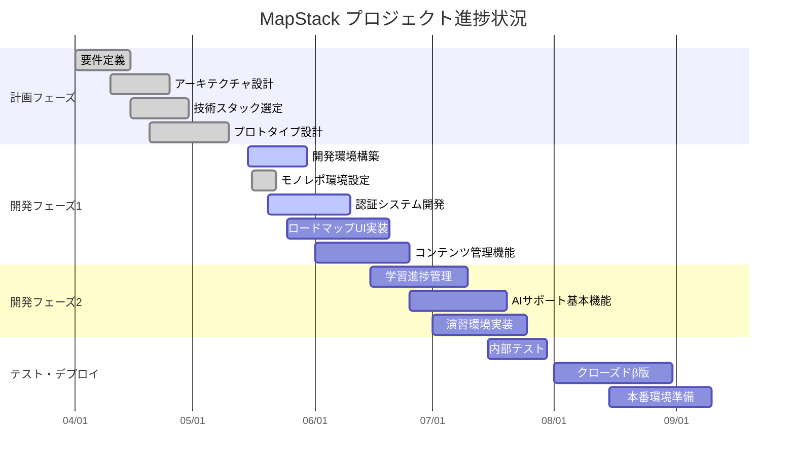
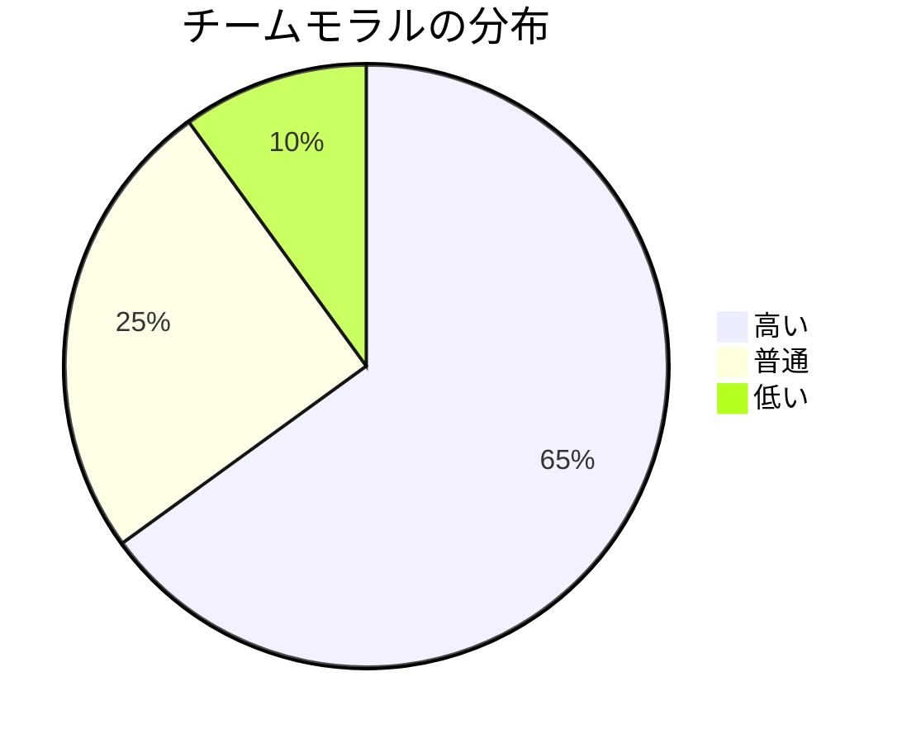

# MapStack プロジェクト状況報告

---
title: プロジェクト状況報告
importance: high
last_updated: 2025-04-04
report_type: 月次
for_ai_assistant: このドキュメントはMapStackプロジェクトの現在の進捗状況、リスク、重要な意思決定を記録しています。最新の開発状況を理解するために参照してください。
---

## 全体進捗ダッシュボード

### 進捗サマリー

| 領域 | ステータス | 進捗率 | トレンド | 注記 |
|------|----------|--------|---------|------|
| 計画フェーズ | 🟢 完了 | 100% | ↑ | 予定通り完了 |
| 開発フェーズ1 | 🟡 進行中 | 25% | → | 環境構築に遅延あり |
| 開発フェーズ2 | ⚪ 未開始 | 0% | - | 7月開始予定 |
| テスト・デプロイ | ⚪ 未開始 | 0% | - | 8月開始予定 |
| **全体** | 🟡 進行中 | 30% | → | ほぼ計画通り |

## マイルストーン達成状況

| # | マイルストーン | 目標日 | 実績/予測 | ステータス | 所有者 | 備考 |
|---|--------------|-------|----------|----------|-------|------|
| 1 | プロジェクト計画完了 | 2023-04-30 | 2023-05-05 | ✅ 完了 | 加藤 | 技術調査に5日遅延 |
| 2 | 環境構築完了 | 2023-05-30 | 2023-06-05 | 🔄 進行中 | 伊藤 | AWS構成に修正必要 |
| 2.1 | モノレポ環境構築 | 2023-05-22 | 2023-05-22 | ✅ 完了 | 伊藤 | スクリプト統合による効率化実現 |
| 3 | 認証機能MVP完成 | 2023-06-10 | 2023-06-10 | 🔄 進行中 | 山本 | 予定通り進行中 |
| 4 | ロードマップ機能MVP | 2023-06-20 | 2023-06-25 | 🔄 計画中 | 鈴木 | 技術的課題を検討中 |
| 5 | 学習管理機能MVP | 2023-07-10 | 2023-07-15 | ⏳ 未着手 | 佐藤 | 依存関係によりやや遅延リスク |
| 6 | AI機能統合 | 2023-07-20 | 2023-07-20 | ⏳ 未着手 | 田中 | 予定通り |
| 7 | クローズドβ開始 | 2023-08-01 | 2023-08-10 | ⏳ 未着手 | 加藤 | テスト準備に時間を追加 |
| 8 | 一般公開 | 2023-09-15 | 2023-09-15 | ⏳ 未着手 | 全員 | - |

### 主要KPI進捗状況

| KPI | 目標 | 現状 | 進捗率 | トレンド |
|-----|------|------|--------|---------|
| コード品質（テスト網羅率） | 80% | 65% | 81% | ↑ |
| ビルド/テスト時間 | <10分 | 14分 | 71% | ↓ |
| 未解決バグ数 | <20 | 12 | 100% | → |
| ユーザーストーリー完了数 | 120 | 35 | 29% | ↑ |

## リスク管理表

| ID | リスク | 影響度 (1-5) | 発生確率 (1-5) | スコア | ステータス | 対応策 | 担当者 |
|----|-------|---------------|----------------|-------|---------|--------|------|
| R1 | AWS使用コストの予算超過 | 4 | 3 | 12 | 🟡 監視中 | コスト最適化施策の実施 デプロイ環境の分離 | 伊藤 |
| R2 | インタラクティブUI実装の複雑化 | 4 | 4 | 16 | 🔴 対応中 | 外部ライブラリの検討 段階的実装方針への変更 | 鈴木 |
| R3 | AI APIコスト増大 | 5 | 2 | 10 | 🟡 監視中 | プロンプト最適化 キャッシュ導入 使用上限設定 | 田中 |
| R4 | チーム間の技術的コミュニケーション不足 | 3 | 3 | 9 | 🟢 改善 | 週次技術共有会 ドキュメント強化 | 中村 |
| R5 | 学習データモデルの設計難航 | 4 | 3 | 12 | 🟡 監視中 | 外部専門家の招聘 プロトタイプの前倒し | 佐藤 |
| R6 | 主要メンバーの離脱 | 5 | 1 | 5 | 🟢 監視中 | ナレッジ共有 ドキュメント整備 | 加藤 |
| R7 | セキュリティ脆弱性の発見 | 5 | 2 | 10 | 🟡 監視中 | 定期的なセキュリティレビュー ペネトレーションテスト | 山本 |

### リスク対応活動（今週）

- R2（UI実装複雑化）に対する対応チーム結成
- R4（コミュニケーション）改善のための技術勉強会実施（5/24）
- R7（セキュリティ）対応として認証システムの外部レビュー依頼

## 意思決定ログ

| ID | 日付 | 決定事項 | 背景・理由 | 代替案 | 決定者 | 影響範囲 |
|----|------|---------|-----------|--------|-------|---------|
| D1 | 2023-04-15 | Next.jsとFastAPIの採用 | モダンなフレームワークによる開発効率化 チームのスキルセットに適合 | React+Express Django+React | 技術チーム | アーキテクチャ全体 |
| D2 | 2023-04-28 | PostgreSQLの採用 | JSONBによるフレキシブルなデータ構造 トランザクション信頼性 | MongoDB MySQL | 佐藤 | データモデル設計 |
| D3 | 2023-05-10 | API First開発アプローチ | フロント/バック並行開発による効率化 明確なインターフェース定義 | モノリシック開発 | 中村 | 開発プロセス |
| D4 | 2023-05-15 | OpenAI APIの採用 | 高品質な応答品質 実装の容易さ | 自社モデル開発 オープンソースLLM | 田中 | AIサポート機能 |
| D5 | 2023-05-20 | ロードマップレンダリングをD3.jsに変更 | SVGベースの高度な可視化要件 カスタマイズ性の確保 | Canvasベース カスタム実装 | 鈴木 | ロードマップUI |
| D6 | 2023-05-25 | クローズドβをメンバー100名から開始 | フィードバック品質確保 サーバー負荷テスト | 一般公開 招待制 | 加藤 | リリース計画 |
| D7 | 2023-05-16 | モノレポアーキテクチャの採用 | 開発効率化 一貫した環境構築 | マルチリポジトリ | 伊藤 | 開発プロセス全体 |

## 主要課題と対応状況

| ID | 課題 | 影響 | 対応状況 | 担当者 | 期限 |
|----|------|------|---------|-------|------|
| I1 | インタラクティブロードマップのパフォーマンス問題 | ユーザー体験低下 複雑なマップでのレンダリング遅延 | 🔄 最適化検討中 レンダリング方法の見直し | 鈴木 | 6/5 |
| I2 | AIレスポンス生成時間の長さ | ユーザーのフラストレーション コスト増大 | 🔄 キャッシング導入 非同期UI設計へ変更 | 田中 | 6/10 |
| I3 | 認証システムのセキュリティレビュー未完了 | セキュリティリスク | ⏳ レビュー依頼中 6/2に実施予定 | 山本 | 6/15 |
| I4 | APIドキュメント自動生成の遅れ | フロント/バック連携の非効率化 | 🔄 Swagger UI導入中 | 佐藤 | 6/1 |

## 次期アクションアイテム

| ID | アクション | 優先度 | 担当者 | 期限 | ステータス |
|----|-----------|--------|-------|------|----------|
| A1 | ロードマップ描画コンポーネントのプロトタイプ完成 | 🔴 高 | 鈴木 | 5/31 | 🔄 進行中 |
| A2 | ユーザー認証フローのセキュリティレビュー | 🔴 高 | 山本 | 6/2 | ⏳ 未着手 |
| A3 | コード品質メトリクス設定とCI組み込み | 🟡 中 | 伊藤 | 6/5 | 🔄 進行中 |
| A4 | ロードマップコンテンツ管理UIの設計レビュー | 🟡 中 | 高橋 | 6/7 | ⏳ 未着手 |
| A5 | パフォーマンステスト環境の構築 | 🟢 低 | 伊藤 | 6/15 | ⏳ 未着手 |
| A6 | モノレポ環境のCI/CD構築 | 🔴 高 | 伊藤 | 5/31 | 🔄 進行中 |

## 新規ドキュメント追加

以下の新しいドキュメントが追加されました：

- `docs/planning/monorepo_setup.md` - モノレポ環境のセットアップと管理に関するガイドライン
  - ルートpackage.jsonの設定例
  - 開発環境のセットアップ手順
  - スクリプト実行方法
  - Docker統合環境の利用方法

## チーム健全性

| 指標 | スコア (1-5) | 前回比 | コメント |
|------|------------|--------|---------|
| チームモラル | 4.2 | ↑ | UI実装の課題あるもモチベーション高い |
| コミュニケーション | 3.8 | → | リモートワークのコミュニケーションに課題あり |
| 技術的満足度 | 4.5 | ↑ | モダンスタックによる開発に満足度高い |
| ワークロードバランス | 3.5 | ↓ | フロントエンド開発にやや負荷集中 |
| 意思決定プロセス | 4.0 | → | 透明性のある意思決定に満足 |

## 予算状況

| カテゴリ | 計画予算 | 現在支出 | 消化率 | 予測 | ステータス |
|---------|---------|---------|-------|------|----------|
| 人件費 | ¥15,000,000 | ¥4,200,000 | 28% | ¥15,500,000 | 🟡 注意 |
| AWS/インフラ | ¥2,000,000 | ¥450,000 | 22.5% | ¥2,200,000 | 🟡 注意 |
| AI API費用 | ¥1,500,000 | ¥320,000 | 21% | ¥1,800,000 | 🔴 要対応 |
| ソフトウェア/ツール | ¥800,000 | ¥350,000 | 44% | ¥750,000 | 🟢 良好 |
| その他費用 | ¥700,000 | ¥150,000 | 21% | ¥650,000 | 🟢 良好 |
| **合計** | ¥20,000,000 | ¥5,470,000 | 27% | ¥20,900,000 | 🟡 注意 |

## 次回レポート予定

次回月次レポート: 2023年6月25日

---

*このステータスレポートは毎月末に更新されます。週次の短縮版は毎週金曜日にチームに共有されます。*
